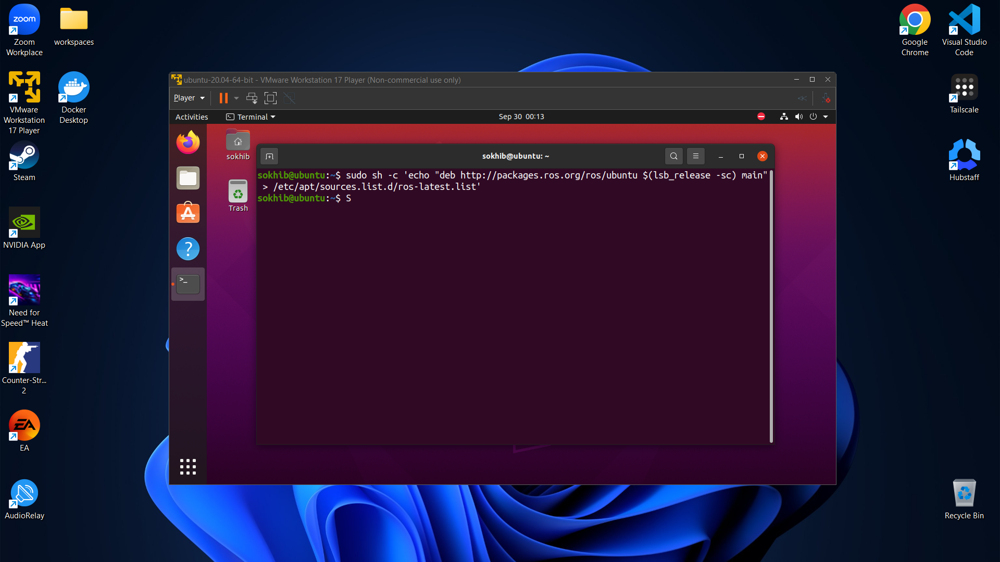

# Week 2  - Setting up Ubuntu 20.04 using VMware player

## Setup Ubuntu 20.04 LTS

### Download the VMWare player from I-class link:
 -  [I-Class Download Link](https://learn.inha.ac.kr/mod/ubfile/view.php?id=1409571)
 -  [VMWare official Download Link](https://softwareupdate.vmware.com/cds/vmw-desktop/player/17.6.0/24238078/windows/core/)

### Install the VMWare player


### Import the Ubuntu OS into VMWare player


### Go through the installation process


## ROS Installation

### 1. Configuring Ubuntu repositories

Allow "restricted," "universe," and "multiverse" repositories.  
You can follow the [Ubuntu guide](https://help.ubuntu.com/community/Repositories/Ubuntu) for instructions.


### 2. Setting up sources.list

Setup computer to accept software from packages.ros.org:

```bash
sudo sh -c 'echo "deb http://packages.ros.org/ros/ubuntu $(lsb_release -sc) main" > /etc/apt/sources.list.d/ros-latest.list'
```



### 3. Setting up keys

Install curl if not already installed, then add the ROS key:

```bash
sudo apt install curl
```

```bash
curl -s https://raw.githubusercontent.com/ros/rosdistro/master/ros.asc | sudo apt-key add -
```


### 4. Installation

Update Debian package index:

```bash
sudo apt update
```

Install ROS Noetic Desktop-Full (recommended):

```bash
sudo apt install ros-noetic-desktop-full -y
```


### 5. Ubuntu Environment Setup

Source the ROS setup script in every bash terminal.  
To do this automatically for every new shell:

```bash
echo "source /opt/ros/noetic/setup.bash" >> ~/.bashrc
source ~/.bashrc
```


### 6. Testing the installation


## Everything Successful 👍✨

## References
- [ROS2 Website](https://docs.ros.org/en/foxy/index.html)
- [Ubuntu Repositories](https://help.ubuntu.com/community/Repositories/Ubuntu)
- [Ubuntu Installation Guide](https://ubuntu.com/tutorials/install-ubuntu-desktop#1-overview)