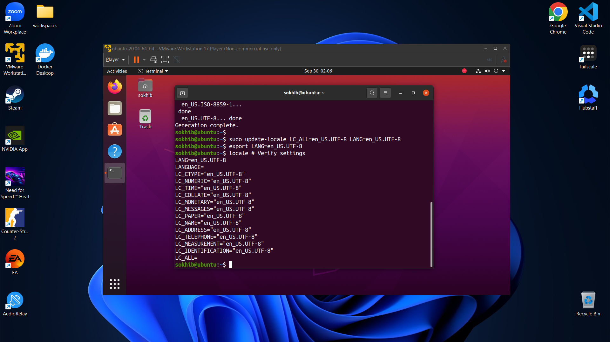
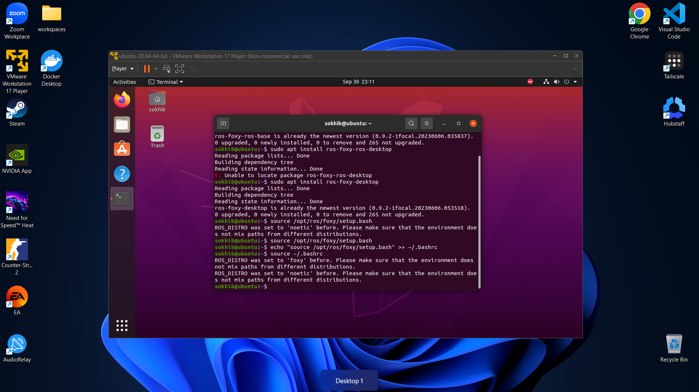

# Week 2 - Setting up ROS2 Foxy on Ubuntu 20.04


**IMPORTANT**
- ROS2 Humble is for Ubuntu 22.04
- ROS2 Foxy is for Ubuntu 20.04

### 1. Set Locale

Make the system support UTF-8:

```bash
locale # Check for UTF-8 support
sudo apt update && sudo apt install locales
sudo locale-gen en_US en_US.UTF-8
sudo update-locale LC_ALL=en_US.UTF-8 LANG=en_US.UTF-8
export LANG=en_US.UTF-8
locale # Verify settings
```




### 2. Setup Sources

#### Enable Universe Repository

Check if Universe is enabled:

```bash
apt-cache policy | grep universe
```


If not enabled, run:

```bash
sudo apt install software-properties-common
sudo add-apt-repository universe
```


#### Add ROS 2 Repository

Authorize the ROS GPG key:

```bash
sudo apt update && sudo apt install curl gnupg lsb-release
sudo curl -sSL https://raw.githubusercontent.com/ros/rosdistro/master/ros.key -o /usr/share/keyrings/ros-archive-keyring.gpg
```


Add the ROS 2 apt repository:

```bash
echo "deb [arch=$(dpkg --print-architecture) signedby=/usr/share/keyrings/ros-archive-keyring.gpg] http://packages.ros.org/ros2/ubuntu $(source /etc/os-release && echo $UBUNTU_CODENAME) main" | sudo tee /etc/apt/sources.list.d/ros2.list > /dev/null
```

> Done - no console output.

### 3. Update Your Apt Repository

```bash
sudo apt update -y
sudo apt upgrade
```
> Done - no console output.

### 4. Install ROS2 Foxy

Recommended: Desktop-Full Install

```bash
sudo apt install ros-foxy-desktop
```

Minimal install (optional):

```bash
sudo apt install ros-foxy-ros-base
```


### 5. Ubuntu Environment Setup

Source ROS setup script in every terminal:

```bash
source /opt/ros/foxy/setup.bash
```

To source automatically:

```bash
echo "source /opt/ros/foxy/setup.bash" >> ~/.bashrc
source ~/.bashrc
```



### 6. Test ROS 2 Installation

#### C++ Example (Talker)

```bash
# install example nodes if not already installed
sudo apt install ros-foxy-demo-nodes-cpp ros-foxy-demo-nodes-py
source /opt/ros/foxy/setup.bash

ros2 run demo_nodes_cpp talker
```

#### Python Example (Listener)

Open another terminal, then:

```bash
source /opt/ros/foxy/setup.bash
ros2 run demo_nodes_py listener
```

