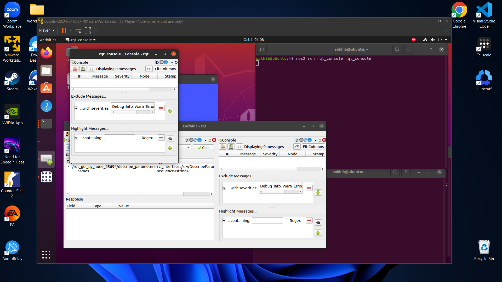

# Week 4 - Setting up Turtlesim in ROS2 Foxy on Ubuntu 20.04

- Turtlesim is a popular ROS2 package that provides a simple simulation environment for learning and experimenting with ROS2 concepts.

### 1. Installation

1.1 Update the package index:

```bash
sudo apt update
```

1.2 Install the Turtlesim package:

```bash
sudo apt install ros-foxy-turtlesim
```

1.3 Verify the installation:

```bash
ros2 pkg executables turtlesim
```


### 2. Running Turtlesim

2.1 Open a terminal and run the Turtlesim node:

```bash
ros2 run turtlesim turtlesim_node
```


2.2 Control the turtle type the following command

```bash
ros2 run turtlesim turtle_teleop_key
```


## RQT Integration
- RQT is a GUI tool for ROS 2.
- Everything done in RQT can be done on the command line.
- RQT provides a more user-friendly way to manipulate ROS 2
elements.

### 3. Installing RQT

3.1 Install RQT and the Turtlesim plugin:

Update the package index:

```bash
sudo apt-get update
```

Install RQT and the Turtlesim plugin:

```bash
sudo apt install ros-foxy-rqt ros-foxy-rqt-common-plugins
```


3.2 Use RQT to control Turtlesim

```bash
rqt
```

### 4. Using RQT with Turtlesim

4.1 In the RQT window, go to `Plugins` > `Services` > `Service caller`.


4.2 Start using rqt_console to see the logs

```bash
ros2 run rqt_console rqt_console
```



- The first section of the console is where log messages from your system will display.
- In the middle, you can filter messages by excluding severity levels.
- The bottom section is for highlighting messages that include a string you input.


4.3 ROS2 Graphical Interface

- The ROS graph is a network of ROS 2 elements processing data together at one time.
- It encompasses all executables and the connections between them if you were to map them all out and visualize them.

```bash
ros2 run rqt_graph rqt_graph
```
