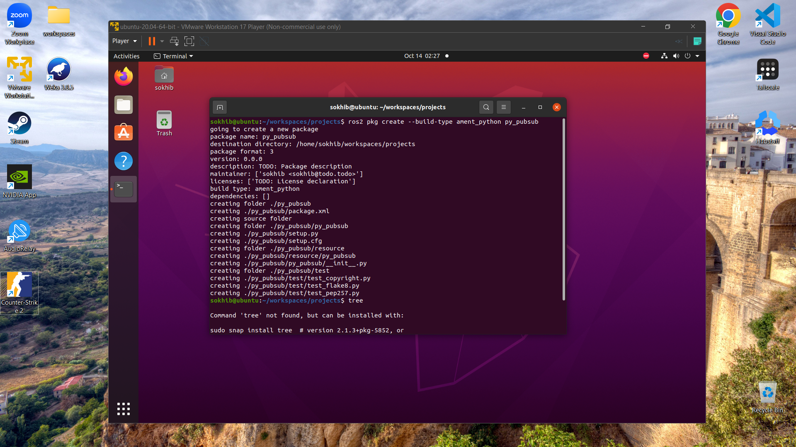
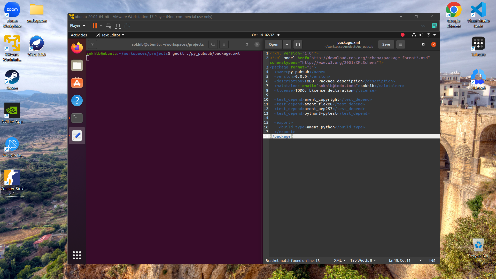
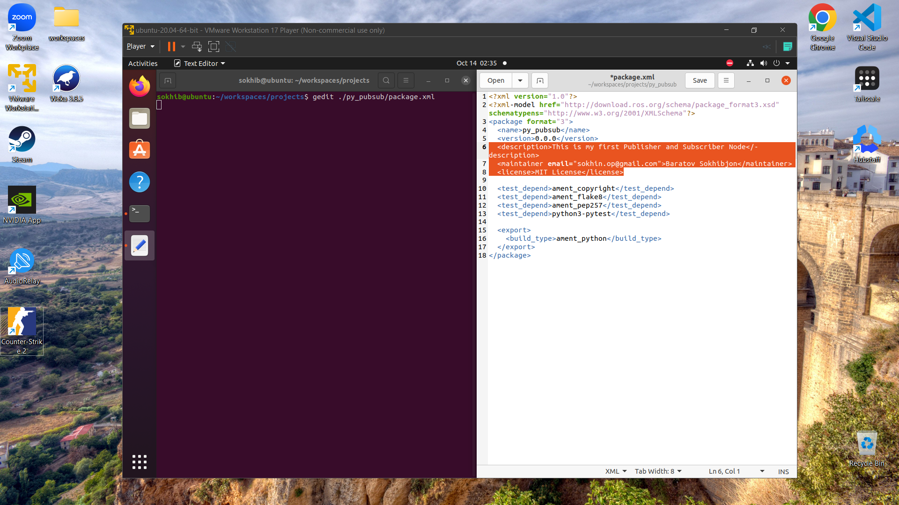
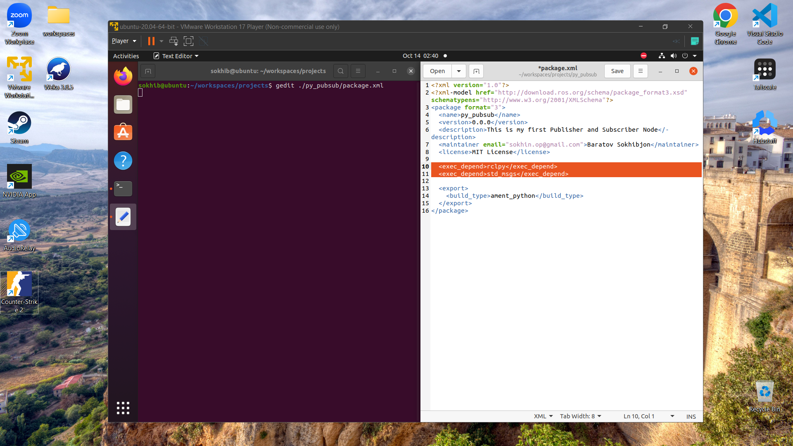
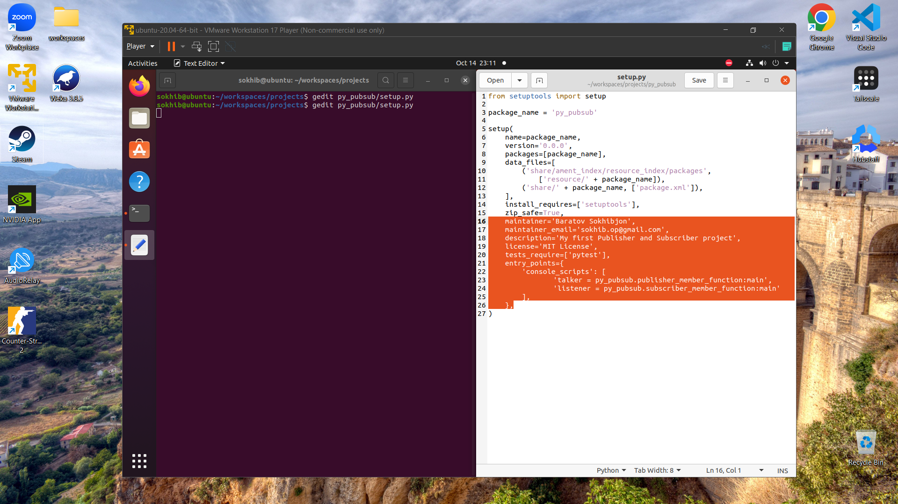
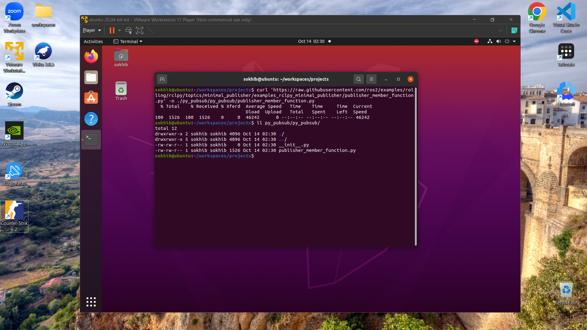
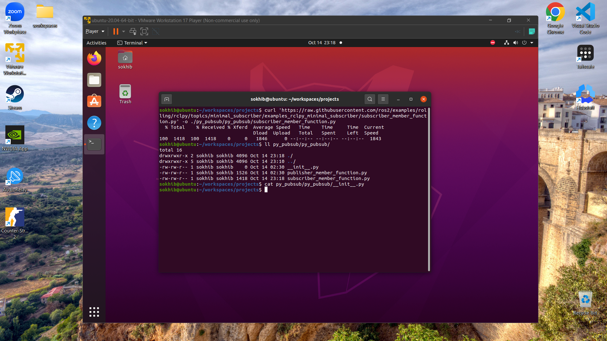
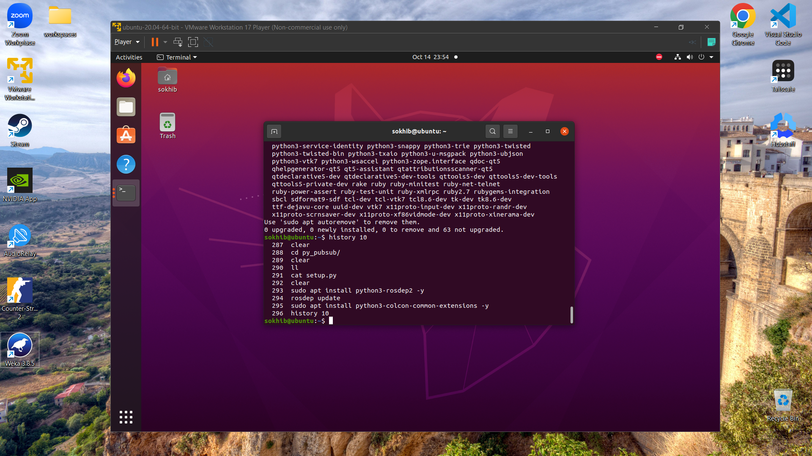
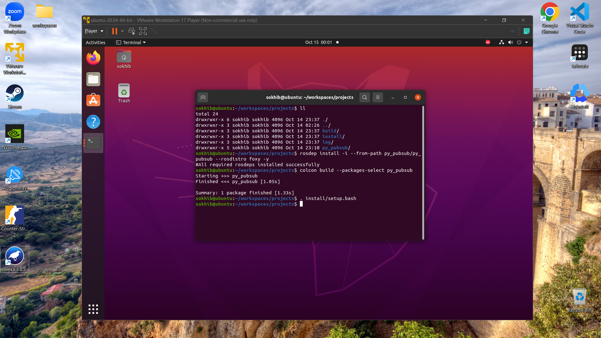
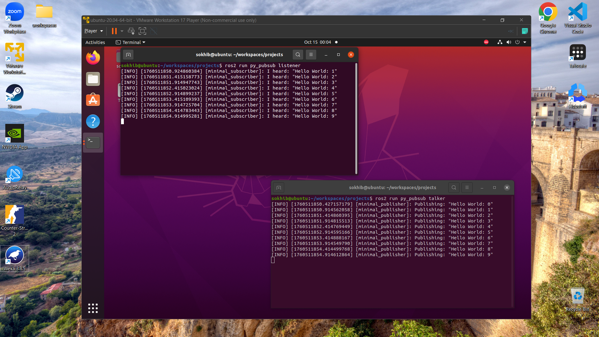

# Week 5 - Publisher-Subscriber Model

### Setting up simple Publisher and Subscriber nodes in ROS2 Foxy on Ubuntu 20.04

#### Step 1: Create a new ROS2 package
```sh
ros2 pkg create --build-type ament_python py_pubsub
```



####  Step 2.1: Open package.xml with your text editor.
```sh
gedit ./py_pubsub/package.xml
```



#### Step 2.2: Configure information inside the `<description>`, `<maintainer>` and `<license>` tags.
```xml
  <description>This is my first Publisher and Subscriber Node</description>
  <maintainer email="sokhin.op@gmail.com">Baratov Sokhibjon</maintainer>
  <license>MIT License</license>
```



#### Step 2.3: Add the dependencies inside the `<depend>` tags.
```xml
  <depend>rclpy</depend>
  <depend>std_msgs</depend>
```



#### Step 2.4: Configure setup.py
```sh
gedit ./py_pubsub/setup.py
```



#### Step 3: Get the example subscriber & publisher node

##### Publisher Node
```sh
curl 'https://raw.githubusercontent.com/ros2/examples/foxy/rclpy/topics/minimal_publisher/examples_rclpy_minimal_publisher/publisher_member_function.py' -o ./py_pubsub/py_pubsub/publisher_member_function.py
```



##### Subscriber Node
```sh
curl 'https://raw.githubusercontent.com/ros2/examples/foxy/rclpy/topics/minimal_subscriber/examples_rclpy_minimal_subscriber/subscriber_member_function.py' -o ./py_pubsub/py_pubsub/subscriber_member_function.py
```



#### Step 4: Install dependencies

- Install `rosdep` if you haven't already
```sh
sudo apt install python3-rosdep2 -y
```
- Update `rosdep`
```sh
rosdep update
```

- Install `colcon` if you haven't already
```sh
sudo apt install python3-colcon-common-extensions -y
```




- Build the package
```sh
rosdep install -i --from-path py_pubsub/py_pubsub --rosdistro foxy -y
```

```sh
colcon build --packages-select py_pubsub
```

- Source the package
```sh
. install/setup.bash
```




- Run the nodes
```sh
ros2 run py_pubsub talker
```

```sh
ros2 run py_pubsub publisher
```



<!-- Conclusion -->

### Conclusion
In this assignment, we successfully created a simple Publisher and Subscriber nodes in ROS2 Foxy on Ubuntu 20.04. We learned how to set up a ROS2 package, configure the necessary files, and run the nodes to see the communication between them. This foundational knowledge will be essential for building more complex robotic applications using ROS2.